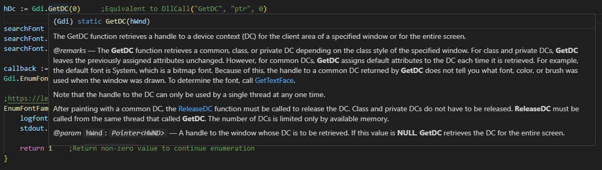

# AhkWin32Projection
Win32 bindings for AutoHotkey V2. 

This project allows you to replace this:
```autohotkey v2
rect := Buffer(16, 0)
NumPut("int", 20, rect, 12)
```

With much more friendly, object-oriented syntax:
```autohotkey
myRect := Rect()
myRect.top := 20
```

Replace `DllCall`s with far more readable function calls...
```autohotkey
hDC := DllCall("GetDC", "ptr", 0)
hDC := Gdi.GetDC(0)                 ;Readable!
```

With rich IntelliSense features and full documentation directly in your IDE:


## Table of Contents
- [AhkWin32Projection](#ahkwin32projection)
  - [Table of Contents](#table-of-contents)
  - [What Is This?](#what-is-this)
  - [Usage](#usage)
    - [Common Namespaces](#common-namespaces)
  - [Structs](#structs)
    - [Creating Structs](#creating-structs)
    - [Arrays](#arrays)
      - [String Members](#string-members)
    - [Handles](#handles)
      - [Handle Ownership](#handle-ownership)
    - [Other Notes](#other-notes)
  - [COM Interfaces](#com-interfaces)
    - [Implementing COM Interfaces](#implementing-com-interfaces)
  - [Enums and Constants](#enums-and-constants)
  - [Methods](#methods)
    - [Strings](#strings)
      - [As Arguments](#as-arguments)
      - [As Return Values](#as-return-values)
    - [Notes](#notes)
  - [Limitations](#limitations)
  - [Links](#links)


## What Is This?
This project provides bindings Win32 APIs in 64-bit AutoHotkey V2. It aims greatly simplify the process of working with structs, non-IDispatch COM interfaces, and DllCalls and to alleviate the plague of [magic numbers](https://en.wikipedia.org/wiki/Magic_number_(programming)) that afflicts AutoHotkey programmers.

The project provides generated struct proxy objects, COM interface proxy objects, constant values, and friendly `DllCall` wrappers with doc comments rich Intellisense documentation compatible with [AHK++](https://github.com/mark-wiemer/ahkpp).

Imagine you wanted to enumerate all the fonts on your system:
```autohotkey v2
stdout := FileOpen("*", "w")

hDc := Gdi.GetDC(0)     ;Equivalent to DllCall("GetDC", "ptr", 0)

searchFont := LOGFONTW()
searchFont.lfCharSet := FONT_CHARSET.ANSI_CHARSET
searchFont.lfFaceName := "Papyrus"

callback := CallbackCreate(EnumFontFamExProc, "Fast", 4)
Gdi.EnumFontFamiliesExW(hDc, searchFont, callback, 0, 0)

;https://learn.microsoft.com/en-us/previous-versions/dd162618(v=vs.85)
EnumFontFamExProc(lpelfe, lpntme, fontType, lparam){
    logfont := LOGFONTW(lpelfe)
    stdout.WriteLine(logfont.lfFaceName)

    return 1    ;Return non-zero value to continue enumeration
}
```
~~No more~~ fewer magic numbers, much more readable code, no mucking around deprecated Win32 documentation!

## Usage
This project is intended to be used as a library. You can "install" it by cloning the repo into an AutoHotkey [library directory](https://www.autohotkey.com/docs/v2/Scripts.htm#lib), and then reference types in your script using `<library>` syntax. Note that many scripts also include other dependent scripts. Files are organized by namespace:

```autohotkey v2
#Include <AhkWin32Projection\Windows\Win32\Foundation\RECT>
#Include <AhkWin32Projection\Windows\Win32\UI\Controls\HDITEMW>
```

### Common Namespaces
Namespaces can be unintuitive and they aren't really mapped to headers, so a few common namespaces are listed here. GitHub's file search functionality is also great if you're looking for something specific. Namespaces come directly from the metadata, so they won't be changed unless Microsoft changes them.

<details>
  <summary>Commonly used Namespaces</summary>
  
  - [`Windows\Win32\UI\Controls`](./Windows/Win32/UI/Controls): Most Gui and GuiControl related types
  - [`Windows\Win32\UI\WindowsAndMessaging`](./Windows/Win32/WindowsAndMessaging): Contains more fundamental window-related structs and enums (e.g. the [`WINDOW_EX_STYLE`](./Windows/Win32/UI/WindowsAndMessaging/WINDOW_EX_STYLE.ahk) enum)
  - [`Windows\Win32\Foundation`](./Windows/Win32/Foundation): Contains types common to all namespaces like [`RECT`](https://learn.microsoft.com/en-us/windows/win32/api/windef/ns-windef-rect), [`FILETIME`](https://learn.microsoft.com/en-us/windows/win32/api/minwinbase/ns-minwinbase-filetime), and [`POINT`](https://learn.microsoft.com/en-us/windows/win32/api/windef/ns-windef-point).
  - [`Windows\Win32\Graphics\Gdi`](./Windows/Win32/Graphics/Gdi) and [`GdiPlus`](./Windows/Win32/Graphics/GdiPlus) : Contains most graphics-related types not otherwise contained in `UI\Controls` - font structs like [`LOGFONTW`](https://learn.microsoft.com/en-us/windows/win32/api/wingdi/ns-wingdi-logfontw), for example.
  - [`Windows\Win32\System\LibraryLoader`](./Windows/Win32/System/LibraryLoader): Functions for loading and working with DLL and EXE files, including accessing resources in them.
    - Note that for whatever reason, [`FreeLibrary`](https://learn.microsoft.com/en-us/windows/win32/api/libloaderapi/nf-libloaderapi-freelibrary) is in the Foundations namespace
  - [`Windows\Win32\Networking\WinHttp`](./Windows/Win32/Networking/WinHttp): WinHTTP-related items (see also: [About WinHTTP - Win32 apps | Microsoft Learn](https://learn.microsoft.com/en-us/windows/win32/winhttp/about-winhttp)).
    - Note that COM objects are not included in the bindings, but you can still use the WinHttpRequest COM object. The namespace provides structs and Apis for additional functionality.
  - [`Windows\Win32\System\Memory`](./Windows/Win32/System/Memory): Contains Apis for direct memory manipulation, including the direct allocation and freeing of heap resources, for advanced users.
  - [`Windows\Win32\System\Com`](./Windows/Win32/System/Com): Foundational COM interfaces and APIs, including `IUnknown` itself and methods like `CoCreateInstance`
</details>

## Structs
All structs are represented with proxy objects extending [`Win32Struct`](./Win32Struct.ahk). The base class provides utilities for initializing structs, cloning, copying, and comparing memory blocks. Struct proxy objects have properties whose getters and setters invoke [`NumGet`](https://www.autohotkey.com/docs/v2/lib/NumGet.htm) and [`NumPut`](https://www.autohotkey.com/docs/v2/lib/NumPut.htm) (or occasionally [StrGet](https://www.autohotkey.com/docs/v2/lib/StrGet.htm) / [StrPut](https://www.autohotkey.com/docs/v2/lib/StrPut.htm)):
```autohotkey v2
cchTextMax {
    get => NumGet(this, 24, "int")
    set => NumPut("int", value, this, 24)
}
```

Embedded structs are not flattened (though unions are). For example, to get the handle of the window for which a [`NMHDDISPINFOW`](./Windows/Win32/UI/Controls/NMHDDISPINFOW.ahk) message was dispatched, you simply access its `hdr` property:
```autohotkey v2
hwnd := dispInfo.hdr.hwndFrom
``` 

Struct proxies are [buffer-like](https://www.autohotkey.com/docs/v2/lib/Buffer.htm#like), so you can use them anywhere you would use a native Buffer. You can also access the `ptr` property directly. Unlike native AutoHotkey Buffers, struct proxies cannot be moved or resized.

> [!IMPORTANT]
> `Win32Struct` AutoHotkey objects are _proxy objects_ representing a "physical" struct somewhere in memory. The actual objects simply hold pointers to memory which may or may not be valid. It is perfectly legal to create multiple proxies for the same block of memory, but this is wasteful and can lead to somewhat confusing behavior:
> ```autohotkey
> header1 := NMHDR(lParam)
> header2 := NMHDR(lParam)
>
> MsgBox(header1 == header2)                    ; False - these are two objects pointing to the same address
> MsgBox(header1.ptr == header2.ptr)            ; True
> MsgBox(header1.MemoryEquals(header2)          ; Also true
> MsgBox(header1.Clone().ptr == header2.ptr)    ; False - Clone() copies the memory into a new Buffer
> MsgBox(header1.Clone().MemoryEquals(header2)  ; True - the memory blocks are identical, just at different locations 
> ```
> To determine if two proxy objects point to the same location in memory, compare their `ptr` properties. To determine if their underlying memory blocks are equal, use the `MemoryEquals()` method.

Support for [AHK V2.1 Structures](https://www.autohotkey.com/boards/viewtopic.php?f=37&t=136827) is forthcoming, but I will prioritize the current stable release. (2.1 support will also include reorganizing the generated scripts into [modules](https://www.autohotkey.com/boards/viewtopic.php?f=37&t=130056).

### Creating Structs
The `Win32Struct.__New` takes a pointer as its only argument. If that pointer is 0, a new [`Buffer`](https://www.autohotkey.com/docs/v2/lib/Buffer.htm) is created to serve as the object's backing memory. This buffer is always cleared; every member of a new struct starts as 0 / `NULL`. If the pointer is not zero, the pointer is taken to be a pointer to the start of the struct proxy's memory block. Thus all you need to create a struct proxy is its pointer, as with the font enumeration example above:
```autohotkey v2
logfont := LOGFONTW(lpelfe)     ;Create a LOGFONTW struct at the pointer lpelfe
logfont := LOGFONTW()           ;Create a new LOGFONTW struct backed by a Buffer
```

> [!CAUTION]
> When a proxy object is created at an existing memory location, the script has no way to know whether or not the underlying memory is valid. You can easily cause fatal errors by keeping references to proxies after their underlying memory has been freed, or by creating proxies at invalid memory locations.
> 
> You can use `Win32Struct.Clone()` to create a clone of a struct backed by a `Buffer` if you need to hold on to struct values after the struct is freed.

You can also initialize new structs using object literals. This works with embedded structures and array members as well. This method copies properties from the object literal into the struct member of the same name.
```autohotkey v2
Wp := WINDOWPLACEMENT({
	length: WINDOWPLACEMENT.sizeof
	showCmd: 1,
	rcNormalPosition: {	  ; An embedded RECT structure
		top: 0,
		bottom: 100,
		left: 0,
		right: 100
	}
})
```
Struct members not present in the object literal remain at their default values (0 / NULL). In the above example ([`WINDOWPLACEMENT`](./Windows/Win32/UI/WindowsAndMessaging/WINDOWPLACEMENT.ahk)), the `flags`, `ptMinPosition`, and `ptMaxPosition` members are left unset and default to 0.

When initializing embedded structs or arrays, you can also provide a reference to an `Array` object or `Win32Struct` proxy object of the same type as the embedded struct. It is marginally faster to set the struct members manually, as doing so does not require the creation or disposal of a temporary object nor the enumeration of its properties.

### Arrays
Arrays in struct proxies are themselves proxy objects extending [`Win32FixedArray`](./Win32FixedArray.ahk). These are typed, fixed-length arrays. The class mimics the applicable functionality of `Array`, allowing enumeration and access via [`__Item`](https://www.autohotkey.com/docs/v2/Objects.htm#__Item).

To create resizeable arrays in script-managed memory, use [`CStyleArray`](./CStyleArray.ahk) objects. 

#### String Members
In cases where it is clear that an array is in fact a string (arrays of `char` or `tchar` elements, for example), properties are generated using `StrPut` and `StrGet`. In this case, assign strings to the properties directly:
```autohotkey v2
lpLogFont := LOGFONTW()
lpLogFont.lfFaceName := "Papyrus"
```
String property getters and setters handle [string encoding](https://www.autohotkey.com/docs/v2/Concepts.htm#string-encoding) automatically. Note that unlike with generated methods, it is not yet possible to pass string pointers to string property getters.

### Handles
Handles like `HINSTANCE`, when detected in the metadata, are wrapped in the [`Win32Handle`](./Win32Handle.ahk) type. `Win32Handle` instances are structs with one pointer-sized member. Handles that are owned by the script are freed automatically when they [fall out of scope](https://www.autohotkey.com/docs/v2/Objects.htm#Refs) in your script.

APIs which return handles will automatically wrap their return values in the appropriate `Win32Handle` derivative type. APIs that accept handles as parameters will automatically unwrap handles when passed them. You can access the underlying value of the handle with the `value` property.

#### Handle Ownership
Handles created by your scripts via `__New` are automatically owned by your script. Similarly, handles in structs created by your script are automatically owned by your script. Most handles returned from APIs are also owned by your script, but this is not guaranteed.

> [!CAUTION]
> You should not manually change a handle's ownership, as this can cause memory leaks. If an API generates an owned handle when it should be unowned, or vice versa, please write an [issue](https://github.com/holy-tao/AhkWin32Projection/issues).

Cloning an owned handle transfers ownership from the owned handle to the new clone. Like with embedded structs, this can be used to extract handle values from memory which would otherwise be freed. Cloning an unowned handle is an error.


### Other Notes
-  Function pointers and "pseudo-primitive" structs like `CHAR` and `HWND` (also known as NativeTypedefs; these are wrapper structs with a single member) have no special handling in generated struct proxies, and are exposed as pure Integers.
  - Use [`CallbackCreate`](https://www.autohotkey.com/docs/v2/lib/CallbackCreate.htm) to create function pointers
- [Unions](https://www.w3schools.com/c/c_unions.php), unlike embedded structs, are flattened. Struct proxies that contain union types will have multiple members at the same offset; in this case, only one can be valid at a time.
- When struct members have conflicting names, the second member has a number appended to it. Type names are not otherwise changed.
  - For example, [`YxyCOLOR`](./Windows/Win32/UI/ColorSystem/YxyCOLOR.ahk) has a member `Y` (uppercase) and `y` (lowercase):
      ```c++
      struct YxyCOLOR {
          WORD Y;
          WORD x;
          WORD y;
       };
      ```
    Because AutoHotkey is [case-insensitive](https://www.autohotkey.com/docs/v2/Concepts.htm#names), `y` (lowercase) is emitted as `y1` to avoid duplicate declaration errors. This can also happen with structs where more than one of the same union is embedded in a struct.
 - In many cases, if a struct contains a `cbSize` member whose size must always be the size of the struct, (e.g. [`GUITHREADINFO`](./Windows/Win32/UI/WindowsAndMessaging/GUITHREADINFO.ahk), that member is set automatically in the proxy object's [`__New`](https://www.autohotkey.com/docs/v2/Objects.htm#Custom_NewDelete) method. This is only true for `cbSize` members, note that there are some more obscure cases where a similar size member is not set automatically.

## COM Interfaces
COM Interfaces are included and use similar syntax to structs. Unlike native AutoHotkey, projected COM interfaces include interfaces that do not implement `IDispatch`. All COM interface proxies are objects extending [`Win32ComInterface`](./Win32ComInterface.ahk). See the [wiki](https://github.com/holy-tao/AhkWin32Projection/wiki/Using-COM-Interfaces) for more details.

COM interface proxies, like struct proxies, are ultimately objects holding pointers to unmanaged memory. Interface implementations hold pointers to virtual function tables held in Buffers. You can create an interface the same way you create a structure; with a pointer to its virtual function table:

```autohotkey
unk := IUnknown(interfacePtr)
```

COM Interface proxy methods are ultimately wrappers around [`ComCall`](https://www.autohotkey.com/docs/v2/lib/ComCall.htm). This is true even of methods on interfaces whose implementations are defined by the script; they simply call into an AHK-managed vtable instead of an external one.

### Implementing COM Interfaces
The projection provides tools for _implementing_ COM interfaces using objects as well. Simply pass an object whose properties include your implementation's methods, and the virtual function table will be created automatically. Additionally, the projection provides default implementations for all of the `IUnknown` methods:

```autohotkey
;https://learn.microsoft.com/en-us/windows/win32/api/objidl/nn-objidl-ipersist
persist := IPersist({
    guid: Guid.Create(),
    GetClassID: (self, vtable, pClassID) => NumPut("ptr", self.guid.ptr, pClassID)
})
```

See the [wiki](https://github.com/holy-tao/AhkWin32Projection/wiki/Implementing-COM-Interfaces) for gotchas and more details.

## Enums and Constants
Enums are simply classes with a series of static read-only variables like so (doc comments removed)
```autohotkey v2
class DUPLICATE_HANDLE_OPTIONS{
    static DUPLICATE_CLOSE_SOURCE => 1
    static DUPLICATE_SAME_ACCESS => 2
}
```

Similarly, constant values are static read-only variables attached to their namespace's `Apis` class - see [Methods](#methods) below.

## Methods
Rather than emitting global functions, methods (and global constants) are all static to a class named after their relevant namespace. These classes live in files called `Apis.ahk` in their relevant directories. This decision was made to improve readability and to prevent the interpreter from allocating global variables which are never used.

To use these methods, simply `#Include` the relevant `Apis` file and call them:
```autohotkey
#Include <AhkWin32Projection\Windows\Win32\Graphics\Gdi\Apis>

hDC := Gdi.GetDC(0)
; Do stuff ...
Gdi.ReleaseDC(0, hDC)
```

For methods that set the [last error](https://www.autohotkey.com/docs/v2/Variables.htm#LastError), the error value is cleared before `DllCall` is invoked and checked immediately afterwards. If it is nonzero (that is, if an error occurred), an [`OSError`](https://www.autohotkey.com/docs/v2/lib/Error.htm#OSError) is thrown.

> [!TIP]
> If your script uses many methods from non-core Dlls, peformance can be improved dramatically by loading the DLLs [explicitly](https://www.autohotkey.com/docs/v2/lib/DllCall.htm#load) either by calling [`LibraryLoader.LoadLibrary`](./Windows/Win32/System/LibraryLoader/Apis.ahk) or by using the [`#DllLoad`](https://www.autohotkey.com/docs/v2/lib/_DllLoad.htm) directive.
> Otherwise, `DllCall` will load and unload the DLLs before and after every API call.

### Strings

#### As Arguments
Strings can be passed to arguments of type `PSTR*` or `PWSTR*` as AutoHotkey variables or literals. In this case, a pointer to the internal memory store is obtained via [`StrPtr`](https://www.autohotkey.com/docs/v2/lib/StrPtr.htm):
```autohotkey
#Include <AhkWin32Projection\Windows\Win32\UI\WindowsAndMessaging\Apis>
#Include <AhkWin32Projection\Windows\Win32\UI\Controls\Dialogs\Apis>

WindowsAndMessaging.RegisterWindowMessageW("commdlg_help")
WindowsAndMessaging.RegisterWindowMessageW(Dialogs.HELPMSGSTRING)
```

You can still pass a string pointer, buffer, or buffer-like object to string arguments; you might prefer this method for performance reasons. Strings passed as AHK variables are not encoded; they will always use UTF-16. As such, to use ANSI methods, you must encode the string yourself and pass a pointer to a buffer.

#### As Return Values
Methods which _return_ strings return their pointers, you can obtain the value with [`StrGet`](https://www.autohotkey.com/docs/v2/lib/StrGet.htm). This is because callers may be interested in the pointer to the returned string rather than its contents, and because copying long strings is slow. For example, when using the return value of one function as an argument to another, it is faster to pass a pointer to the string directly than it would be to create a copy of a string and obtain its pointer after.

### Notes
- Wrapper function inputs apart from strings are not sanitized or type checked.
- Reserved parameters, when marked in the metadata, are omitted from generated function signatures. As such, signatures may differ _slightly_ from the function signatures in Microsoft's documentation.
- In cases where parameter names conflict with reserved words ("this", "in", etc), an underscore is appended to the parameter name.

## Limitations
- Only 64-bit AutoHotkey is currently supported
  - Generated files all have the `#Requires AutoHotkey v2.0.0 64-bit` [directive](https://www.autohotkey.com/docs/v2/lib/_Requires.htm), which should prevent mix-ups.
- Some structs and methods have ANSI and Unicode variants, both are generated. However, AutoHotkey V2 uses UTF-16 by default, and you will save yourself many headaches by sticking to Unicode (-W) variants whenever possible.
    - See also [native encoding](https://www.autohotkey.com/docs/v2/Concepts.htm#native-encoding) (AutoHotkey documentation)
- Only structs with fixed layouts are supported. This means flexible arrays are **not** supported in structs.
- In string constants with unprintable characters, those characters are encoded (e.g. a null character becomes `\0000`) and may need to be decoded before use.
- Macros are not included in the win32metadata project, and so are not included in the generated AutoHotkey code. While many macros have corresponding functions, not all of them do. 
  - See [this issue](https://github.com/microsoft/win32metadata/issues/436) on the win32metadata project page for details.
- Code examples in the documentation are generally in `C++`.
  - Documentation is taken from the [Microsoft.Windows.SKD.Win32Docs](https://www.nuget.org/packages/Microsoft.Windows.SDK.Win32Docs/) package.

## Links
- [Microsoft's win32metadata project](https://github.com/microsoft/win32metadata/tree/main): the data from which these files are generated
- [Generator](https://github.com/holy-tao/AhkWin32Structs-Generator): the actual generator
