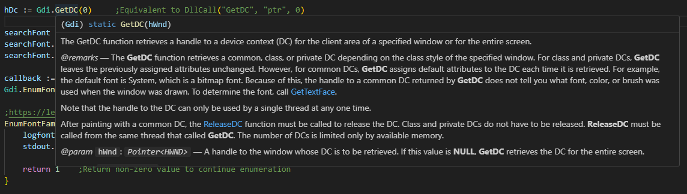

# AhkWin32Projection

Win32 bindings for AutoHotkey v2.1, including struct, function, and COM Interface definitions.

> ![IMPORTANT]
> v2.1 support is experimental and will stay that way for as long as v2.1 remains in alpha.

This project allows you to replace this:

```autohotkey
rect := Buffer(16, 0)
NumPut("int", 20, rect, 12)
```

With much more friendly, object-oriented syntax:

```autohotkey
myRect := Rect()
myRect.top := 20
```

Replace `DllCall`s with far more readable function calls...

```autohotkey
hDC := DllCall("GetDC", "ptr", 0)
hDC := GetDC(0)                 ;Readable!
```

With rich IntelliSense features and full documentation directly in your IDE:


<details>
<summary><strong>Table of Contents</strong></summary>
## Table of Contents

- [Table of Contents](#table-of-contents)
- [What Is This?](#what-is-this)
- [Usage](#usage)
  - [Common Namespaces](#common-namespaces)
- [Structs](#structs)
- [COM Interfaces](#com-interfaces)
  - [Implementing COM Interfaces](#implementing-com-interfaces)
- [Enums and Constants](#enums-and-constants)
- [Methods](#methods)
- [Limitations](#limitations)
- [Links](#links)
  
</details>

## What Is This?

This project provides bindings Win32 APIs in 64-bit AutoHotkey v2.1. It aims greatly simplify the process of working
with structs, non-IDispatch COM interfaces, and DllCalls and to alleviate the plague of
[magic numbers](https://en.wikipedia.org/wiki/Magic_number_(programming)) that afflicts AutoHotkey programmers.

The project provides generated struct, COM interface proxy objects, constant values, and friendly `DllCall` wrappers
with doc comments and rich Intellisense documentation compatible with [AHK++](https://github.com/mark-wiemer/ahkpp).

Imagine you wanted to enumerate all the fonts on your system:

```autohotkey
stdout := FileOpen("*", "w")

hDc := Gdi.GetDC(0)     ;Equivalent to DllCall("GetDC", "ptr", 0)

searchFont := LOGFONTW()
searchFont.lfCharSet := FONT_CHARSET.ANSI_CHARSET
searchFont.lfFaceName := "Papyrus"

callback := CallbackCreate(EnumFontFamExProc, "Fast", 4)
Gdi.EnumFontFamiliesExW(hDc, searchFont, callback, 0, 0)

;https://learn.microsoft.com/en-us/previous-versions/dd162618(v=vs.85)
EnumFontFamExProc(lpelfe, lpntme, fontType, lparam){
    logfont := LOGFONTW(lpelfe)
    stdout.WriteLine(logfont.lfFaceName)

    return 1    ;Return non-zero value to continue enumeration
}
```

~~No more~~ fewer magic numbers, much more readable code, no mucking around deprecated Win32 documentation!

## Usage

This project is intended to be used as a library. You can "install" it by cloning the repo into an AutoHotkey
[library directory](https://www.autohotkey.com/docs/v2/Scripts.htm#lib), and then reference types in your script using
`<library>` syntax. I'll also cut releases after major changes (including metadata updates from Microsoft) that will
remain stable, you can grab the latest one and update manually in
[releases](https://github.com/holy-tao/AhkWin32Projection/releases). If you prefer stability over easy updates, go that route.

Files are organized by namespace, and can be imported via paths:

```autohotkey
#Import "AhkWin32Projection\Windows\Win32\Foundation\RECT" { RECT }
#Include "AhkWin32Projection\Windows\Win32\UI\Controls\HDITEMW { HDITEMW }
```

Functions and constants can be found in namespace-level `Apis` and `Constants` barrels respectively:

```autohotkey
#Import "AhkWin32Projection\Windows\Win32\Foundation\Constants.ahk" { VARIANT_TRUE, VARIANT_FALSE }
#Import "AhkWin32Projection\Windows\Win32\Foundation\Apis.ahk" { SysAllocString, SetLastError }
```

### Common Namespaces

Namespaces can be unintuitive and they aren't really mapped to headers, so a few common namespaces are listed here. GitHub's file search functionality is also great if you're looking for something specific. Namespaces come directly from the metadata, so they won't be changed unless Microsoft changes them.

<details>
  <summary>Commonly used Namespaces</summary>
  
- [`Windows\Win32\UI\Controls`](./Windows/Win32/UI/Controls): Most Gui and GuiControl related types
- [`Windows\Win32\UI\WindowsAndMessaging`](./Windows/Win32/WindowsAndMessaging): Contains more fundamental window-related structs and enums (e.g. the [`WINDOW_EX_STYLE`](./Windows/Win32/UI/WindowsAndMessaging/WINDOW_EX_STYLE.ahk) enum)
- [`Windows\Win32\Foundation`](./Windows/Win32/Foundation): Contains types common to all namespaces like [`RECT`](https://learn.microsoft.com/en-us/windows/win32/api/windef/ns-windef-rect), [`FILETIME`](https://learn.microsoft.com/en-us/windows/win32/api/minwinbase/ns-minwinbase-filetime), and [`POINT`](https://learn.microsoft.com/en-us/windows/win32/api/windef/ns-windef-point).
- [`Windows\Win32\Graphics\Gdi`](./Windows/Win32/Graphics/Gdi) and [`GdiPlus`](./Windows/Win32/Graphics/GdiPlus) : Contains most graphics-related types not otherwise contained in `UI\Controls` - font structs like [`LOGFONTW`](https://learn.microsoft.com/en-us/windows/win32/api/wingdi/ns-wingdi-logfontw), for example.
- [`Windows\Win32\System\LibraryLoader`](./Windows/Win32/System/LibraryLoader): Functions for loading and working with DLL and EXE files, including accessing resources in them.
  - Note that for whatever reason, [`FreeLibrary`](https://learn.microsoft.com/en-us/windows/win32/api/libloaderapi/nf-libloaderapi-freelibrary) is in the Foundations namespace
- [`Windows\Win32\Networking\WinHttp`](./Windows/Win32/Networking/WinHttp): WinHTTP-related items (see also: [About WinHTTP - Win32 apps | Microsoft Learn](https://learn.microsoft.com/en-us/windows/win32/winhttp/about-winhttp)).
- [`Windows\Win32\System\Memory`](./Windows/Win32/System/Memory): Contains Apis for direct memory manipulation, including the direct allocation and freeing of heap resources, for advanced users.
- [`Windows\Win32\System\Com`](./Windows/Win32/System/Com): Foundational COM interfaces and APIs, including `IUnknown` itself and methods like `CoCreateInstance`
- 
</details>

## Structs

Structs are generated v2.1 [structs](https://www.autohotkey.com/docs/alpha/Structs.htm).

Embedded structs are not flattened (though unions are). For example, to get the handle of the window for which a
[`NMHDDISPINFOW`](./Windows/Win32/UI/Controls/NMHDDISPINFOW.ahk) message was dispatched, you simply access its `hdr`
property:

```autohotkey
hwnd := dispInfo.hdr.hwndFrom
```

See the [wiki](https://github.com/holy-tao/AhkWin32Projection/wiki/Structures) for more details.

## COM Interfaces

COM Interfaces are included and use similar syntax to structs. Unlike native AutoHotkey, projected COM interfaces
include interfaces that do not implement `IDispatch`. All COM interface proxies are objects extending
[`Win32ComInterface`](./Win32ComInterface.ahk). See the
[wiki](https://github.com/holy-tao/AhkWin32Projection/wiki/Using-COM-Interfaces) for more details.

COM interface proxies, like struct proxies, are ultimately objects holding pointers to unmanaged memory. Interface
implementations hold pointers to virtual function tables held in Buffers. You can create an interface the same way you
create a structure; with a pointer to its virtual function table:

```autohotkey
unk := IUnknown(interfacePtr)
```

COM Interface proxy methods are ultimately wrappers around
[`ComCall`](https://www.autohotkey.com/docs/v2/lib/ComCall.htm). This is true even of methods on interfaces whose
implementations are defined by the script; they simply call into an AHK-managed vtable instead of an external one.

### Implementing COM Interfaces

The projection provides tools for _implementing_ COM interfaces using objects as well. Simply pass an object whose
properties include your implementation's methods, and the virtual function table will be created automatically.
Additionally, the projection provides default implementations for all of the `IUnknown` methods:

```autohotkey
;https://learn.microsoft.com/en-us/windows/win32/api/objidl/nn-objidl-ipersist
persist := IPersist({
    guid: Guid.Create(),
    GetClassID: (self, vtable, pClassID) => NumPut("ptr", self.guid.ptr, pClassID)
})
```

See the [wiki](https://github.com/holy-tao/AhkWin32Projection/wiki/Implementing-COM-Interfaces) for gotchas and more
details.

## Enums and Constants

Enums are simply classes with a series of static read-only variables like so (doc comments removed)

```autohotkey v2
class DUPLICATE_HANDLE_OPTIONS{
    static DUPLICATE_CLOSE_SOURCE => 1
    static DUPLICATE_SAME_ACCESS => 2
}
```

Similarly, constant values are just exported global variables.

## Methods

Functions are exported globals in files called `Apis.ahk` in their relevant directories.

To use these methods, simply `#Include` the relevant `Apis` file and call them:

```autohotkey
#Include "AhkWin32Projection\Windows\Win32\Graphics\Gdi\Apis" { GetDC, ReleaseDC }

hDC := GetDC(0)
; Do stuff ...
ReleaseDC(0, hDC)
```

For methods that set the [last error](https://www.autohotkey.com/docs/v2/Variables.htm#LastError), the error value is
cleared before `DllCall` is invoked and checked immediately afterwards. If it is nonzero (that is, if an error
occurred), an [`OSError`](https://www.autohotkey.com/docs/v2/lib/Error.htm#OSError) is thrown.

See the [wiki](https://github.com/holy-tao/AhkWin32Projection/wiki/Functions) for more details.

## Limitations

- Only 64-bit AutoHotkey is currently supported
  - Generated files all have the `#Requires AutoHotkey v2.0.0 64-bit` [directive](https://www.autohotkey.com/docs/v2/lib/_Requires.htm), which should prevent mix-ups.
- Some structs and methods have ANSI and Unicode variants, both are generated. However, AutoHotkey V2 uses UTF-16 by default, and you will save yourself many headaches by sticking to Unicode (-W) variants whenever possible.
  - See also [native encoding](https://www.autohotkey.com/docs/v2/Concepts.htm#native-encoding) (AutoHotkey documentation)
- Only structs with fixed layouts are supported. This means flexible arrays are **not** supported in structs.
- Macros are not included in the win32metadata project, and so are not included in the generated AutoHotkey code. While many macros have corresponding functions, not all of them do. 
  - See [this issue](https://github.com/microsoft/win32metadata/issues/436) on the win32metadata project page for details.
- Code examples in the documentation are generally in `C++`.
  - Documentation is taken from the [Microsoft.Windows.SKD.Win32Docs](https://www.nuget.org/packages/Microsoft.Windows.SDK.Win32Docs/) package.

## Links

- Microsoft's [win32metadata project](https://github.com/microsoft/win32metadata/tree/main): the data from which the files in the `Windows.Win32` namespace are generated
- The [community wdkmetadata project](https://github.com/microsoft/wdkmetadata): the data from which the files in the `Windows.Wdk` namespace are generated
- [Generator](https://github.com/holy-tao/AhkWin32Structs-Generator): the actual generator
